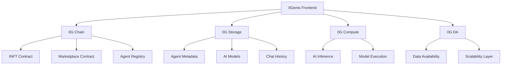
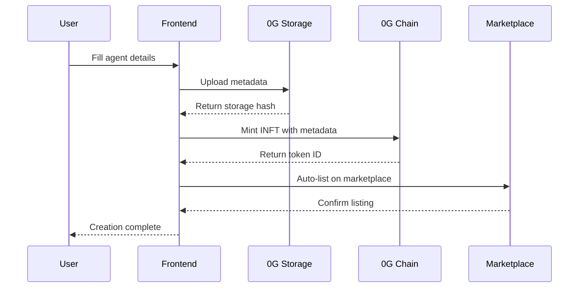
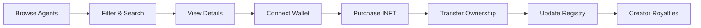

# 🤖 0Gents - AI Agent INFT Marketplace

> **The world's first decentralized marketplace for AI-powered Intelligent NFTs, built on 0G Network's revolutionary infrastructure**

[](https://www.0gents.shop)
[](https://chainscan.0g.ai)
[](https://youtu.be/nIPRd8aUGBg)
[](https://0g.ai)
[](LICENSE)

## 🚀 **NOW LIVE ON 0G MAINNET!**

🎉 **0Gents is production-ready and deployed on 0G Mainnet (Chain ID: 16661)**

- ✅ **Factory Contract**: [`0x9834a0B8B3789646408Cf4C3DCC41Dd580F50785`](https://chainscan.0g.ai/address/0x9834a0B8B3789646408Cf4C3DCC41Dd580F50785)
- ✅ **Marketplace Contract**: [`0x1320CB9AE8fB7D30f834AB5553C60dDeF0362dBB`](https://chainscan.0g.ai/address/0x1320CB9AE8fB7D30f834AB5553C60dDeF0362dBB)
- 🌐 **Live App**: [https://www.0gents.shop](https://www.0gents.shop)
- 📚 **Deployment Guide**: [DEPLOYMENT.md](DEPLOYMENT.md)

## 🎯 **What is 0Gents?**

0Gents is the **first comprehensive decentralized marketplace** specifically designed for AI-powered Intelligent NFTs (INFTs). Unlike traditional NFT marketplaces that deal with static images, 0Gents creates a living ecosystem where each NFT contains an actual AI agent that users can interact with, trade, and monetize.

### 🌟 **Why 0Gents?**

- **🧠 Living Digital Assets**: Each INFT contains a fully functional AI agent with unique personality and capabilities
- **⚡ 0G Network Power**: Leverages 0G's modular blockchain infrastructure for unparalleled performance
- **💰 Creator Economy**: Sustainable revenue streams for AI developers and digital artists  
- **🌐 Decentralized**: No central authority, complete ownership and control
- **🔒 Transparent**: All transactions and agent behaviors are verifiable on-chain

## 🌟 Overview

0Gents is a cutting-edge decentralized marketplace where users can create, trade, and interact with AI-powered Intelligent NFTs (INFTs). Built on the revolutionary 0G Network, it combines the power of AI agents with blockchain technology to create truly intelligent digital assets.

## ✨ **Core Features**

### 🎨 **AI Agent Creation Studio**
- **Intelligent NFT Minting** - Create AI agents with unique personalities, skills, and capabilities
- **Visual Agent Designer** - Intuitive interface for defining agent characteristics
- **Category Selection** - Trading, Gaming, Art, Development, DeFi, and more specialized niches
- **Price Setting** - Flexible pricing models for different agent types
- **Social Integration** - Link agents to Twitter, websites, and other platforms

### 💬 **Real-Time AI Interactions**
- **0G Compute Integration** - Lightning-fast AI inference powered by 0G's decentralized compute network
- **Persistent Conversations** - Chat history and context maintained across sessions
- **Multi-Modal Capabilities** - Text, voice, and future support for visual interactions
- **Agent Personalities** - Each AI has distinct behavior patterns and response styles
- **Usage Metrics** - Track interactions, popularity, and engagement analytics

### 🛒 **Advanced Marketplace**
- **Professional Trading Interface** - Enterprise-grade UI with smooth animations and responsive design
- **Smart Contract Integration** - Secure, transparent, and instant transactions
- **Featured Collections** - Curated showcases of trending and high-quality agents
- **Advanced Filtering** - Search by category, price range, creator, popularity metrics
- **Cross-User Visibility** - Global marketplace where all users can discover and trade agents

### 🔗 **0G Network Integration**
- **0G Storage** - Decentralized metadata storage ensuring permanent accessibility
- **0G Chain** - High-performance EVM-compatible blockchain for INFT operations
- **0G Compute** - Distributed AI inference network for agent interactions
- **0G DA** - High-throughput data availability layer for scalable operations
- **Contract Transparency** - One-click verification via 0G Explorer integration

### 💰 **Creator Economy Features**
- **Automatic Royalties** - 90% of sales go directly to original creators
- **Auto-Listing** - Newly created INFTs are automatically listed on the marketplace
- **Engagement Tracking** - Views, likes, and interaction metrics for market insights
- **Revenue Analytics** - Comprehensive dashboards for creator earnings and performance
- **Professional Tools** - Advanced features for serious AI developers and digital artists

## 🏗️ **Technical Architecture**

### 🌐 **0G Network Stack Integration**



### ⛓️ **Blockchain Layer (0G Chain)**
- **INFT Contract** - ERC-721 based intelligent NFTs with enhanced metadata and creation fees
- **Marketplace Contract** - Decentralized trading platform with automated royalty distribution
- **Agent Registry** - Central registry maintaining agent metadata and verification status
- **Fee Management** - Smart contract-based fee collection and distribution system

### 💾 **Storage Layer (0G Storage) - ✅ FULLY INTEGRATED**
- **Agent Metadata** - Real decentralized storage using 0G Storage SDK with Merkle tree verification
- **AI Model Data** - Secure storage of trained models and agent-specific parameters
- **Chat History** - Persistent conversation logs and interaction data
- **Media Assets** - Profile images, demo content, and promotional materials
- **Real Contract Integration** - Using actual 0G Storage testnet contracts
  - Flow: `0xbD75117F80b4E22698D0Cd7612d92BDb8eaff628`
  - Mine: `0x3A0d1d67497Ad770d6f72e7f4B8F0BAbaa2A649C`
  - Market: `0x53191725d260221bBa307D8EeD6e2Be8DD265e19`
  - Reward: `0xd3D4D91125D76112AE256327410Dd0414Ee08Cb4`
- **Fallback System** - Intelligent simulation fallback for network instability
- **Performance Optimized** - Server-side processing with retry mechanisms

### 🧠 **Compute Layer (0G Compute)**
- **Distributed AI Inference** - Scalable AI model execution across the 0G compute network
- **Real-Time Processing** - Low-latency response generation for interactive conversations
- **Model Optimization** - Dynamic resource allocation based on agent complexity and demand
- **Usage Metering** - Transparent tracking and billing for compute resource consumption

### 📊 **Data Availability (0G DA)**
- **High-Throughput Transactions** - Efficient handling of marketplace operations and agent interactions
- **Scalability Solutions** - Support for growing user base and increasing transaction volume
- **Data Integrity** - Ensuring reliable access to agent data and interaction history
- **Cross-Chain Compatibility** - Future support for multi-chain operations and integrations

### 🔧 **Application Architecture**

```typescript
// Frontend Stack
Next.js 15 (App Router)
├── TypeScript (100% type coverage)
├── Tailwind CSS (Responsive design)
├── Wagmi (Ethereum interactions)
├── RainbowKit (Wallet connections)
└── Framer Motion (Animations)

// Smart Contract Stack
Solidity ^0.8.19
├── OpenZeppelin (Security standards)
├── Hardhat (Development framework)
├── TypeChain (Type-safe contract interactions)
└── Ethers.js (Blockchain communication)

// 0G Network Integration
0G SDK
├── Storage API (Metadata management)
├── Compute API (AI inference)
├── Chain RPC (Transaction handling)
└── DA API (Data availability)
```

## 🚀 Quick Start

### Prerequisites

- Node.js 18+ and npm
- Git
- MetaMask or compatible Web3 wallet

### Installation

```bash
# Clone the repository
git clone https://github.com/karagozemin/0Gents-Marketplace.git
cd 0Gents-Marketplace

# Install dependencies
cd agentx/packages/webapp
npm install

# Set up environment variables
cp .env.example .env.local
# Edit .env.local with your configuration

# Start development server
npm run dev
```

Open [https://www.0gents.shop/](https://www.0gents.shop/) to view the application.

## 🔧 Configuration

### Environment Variables

```env
# Wallet Connect
NEXT_PUBLIC_WC_PROJECT_ID=your_wallet_connect_project_id

# 0G Network Configuration
NEXT_PUBLIC_CHAIN_ID=16602
NEXT_PUBLIC_0G_RPC_URL=https://evmrpc-testnet.0g.ai
NEXT_PUBLIC_0G_EXPLORER=https://chainscan-galileo.0g.ai

# Contract Addresses
NEXT_PUBLIC_INFT_ADDRESS=0x...
NEXT_PUBLIC_MARKETPLACE_ADDRESS=0x...
NEXT_PUBLIC_AGENT_REGISTRY_ADDRESS=0x...

# 0G Storage Contracts (Real Testnet Addresses)
NEXT_PUBLIC_0G_STORAGE_FLOW=0xbD75117F80b4E22698D0Cd7612d92BDb8eaff628
NEXT_PUBLIC_0G_STORAGE_MINE=0x3A0d1d67497Ad770d6f72e7f4B8F0BAbaa2A649C
NEXT_PUBLIC_0G_STORAGE_MARKET=0x53191725d260221bBa307D8EeD6e2Be8DD265e19
NEXT_PUBLIC_0G_STORAGE_REWARD=0xd3D4D91125D76112AE256327410Dd0414Ee08Cb4

# 0G DA Contract
NEXT_PUBLIC_0G_DA_ENTRANCE=0x...
```

## 💡 **How It Works**

### 🎨 **1. AI Agent Creation Process**



**Step-by-Step Process:**
1. **Agent Design** - Define name, description, category, price, and capabilities
2. **Social Integration** - Add optional Twitter, website, and other platform links
3. **Payment** - Pay 0.005 0G creation fee to platform wallet
4. **Storage Upload** - Agent metadata securely stored on 0G Storage network
5. **INFT Minting** - Smart contract creates your unique intelligent NFT on 0G Chain
6. **Auto-Listing** - Agent automatically appears on marketplace for trading
7. **Verification** - Contract address provided for blockchain transparency

### 🤖 **2. AI Agent Interactions**

```typescript
// Example interaction flow
const agent = await loadAgent(tokenId);
const response = await agent.chat({
  message: "Hello, tell me about your capabilities",
  context: previousConversations,
  userId: currentUser.address
});

// Agent responds based on:
// - Trained personality model
// - Historical conversation context  
// - User-specific preferences
// - Real-time 0G Compute processing
```

**Interaction Features:**
- **Real-Time Chat** - Instant responses powered by 0G Compute network
- **Persistent Memory** - Agents remember previous conversations and user preferences
- **Unique Personalities** - Each agent has distinct behavior patterns and expertise areas
- **Multi-Modal Support** - Text-based interactions with future voice and visual capabilities
- **Usage Analytics** - Track popularity, engagement, and performance metrics

### 🛒 **3. Marketplace Trading**



**Trading Process:**
- **Discovery** - Browse featured collections, trending agents, and curated showcases
- **Advanced Filtering** - Search by category, price range, creator, engagement metrics
- **Due Diligence** - View agent details, contract verification, and interaction history
- **Secure Purchase** - Blockchain-based transactions with smart contract escrow
- **Instant Transfer** - Immediate ownership transfer upon successful payment
- **Creator Support** - 90% of sale price automatically sent to original creator

### 📊 **4. Creator Economy Dashboard**

**For Creators:**
- **Revenue Analytics** - Track earnings, sales volume, and market performance
- **Agent Performance** - Monitor views, likes, interactions, and user engagement
- **Portfolio Management** - Oversee multiple agents and optimize pricing strategies
- **Community Building** - Connect with users and build loyal followings

**For Collectors:**
- **Portfolio Tracking** - Manage owned agents and track investment performance
- **Usage Analytics** - Monitor personal interactions and favorite agents
- **Marketplace Insights** - Discover trending agents and emerging creators
- **Social Features** - Share favorite agents and build collections

## 💰 Fee Structure

| Operation | Fee | Recipient |
|-----------|-----|-----------|
| Creation Fee | 0.005 0G | Platform Wallet |
| Platform Fee | 10% of sale | Platform Wallet |
| Creator Earnings | 90% of sale | Original Creator |
| Network Fees | ~0.001 0G | 0G Network |

*All fees are configurable by administrators*

## 🛠️ Tech Stack

### Frontend
- **Next.js 15** - React framework with App Router
- **TypeScript** - Type-safe development
- **Tailwind CSS** - Utility-first styling
- **Wagmi** - React hooks for Ethereum
- **RainbowKit** - Wallet connection UI

### Blockchain
- **0G Network** - Layer 1 blockchain
- **Solidity** - Smart contract development
- **Hardhat** - Development framework
- **OpenZeppelin** - Security standards

### AI & Storage
- **0G Compute** - Real decentralized AI inference with verified providers
- **0G Storage** - Real decentralized storage with 4-contract integration (`@0glabs/0g-ts-sdk`)
- **0G DA** - Real data availability layer with epoch tracking
- **Merkle Trees** - Data integrity verification system

## 📁 Project Structure

```
0Gents/
├── agentx/packages/
│   ├── contracts/          # Smart contracts
│   │   ├── contracts/      # Solidity files
│   │   ├── scripts/        # Deployment scripts
│   │   └── artifacts/      # Compiled contracts
│   ├── webapp/             # Next.js frontend
│   │   ├── src/app/        # App Router pages
│   │   ├── src/components/ # React components
│   │   ├── src/lib/        # Utilities & integrations
│   │   └── public/         # Static assets
│   └── sdk/                # 0G SDK integrations
└── docs/                   # Documentation
```

## 🚧 **Development Roadmap**

### ✅ **Wave 1 (Foundation) - Completed**
- [x] **Core INFT System** - Basic intelligent NFT minting and storage
- [x] **0G Network Integration** - Initial connection to 0G Chain, Storage, and Compute
- [x] **Basic Marketplace** - Simple buying and selling functionality
- [x] **AI Chat Interface** - Initial AI agent interaction capabilities
- [x] **Wallet Integration** - MetaMask and Web3 wallet support

### ✅ **Wave 2 (Marketplace Maturity) - Completed**
- [x] **Real Buy Functionality** - Complete blockchain-based purchase system with MetaMask integration
- [x] **Unified Agent System** - Centralized agent management for cross-user visibility
- [x] **Auto-Listing** - Automatic marketplace listing during NFT creation process
- [x] **Celebration Animation** - Success animations and modals for completed purchases
- [x] **Cross-User Visibility** - All users can see and purchase each other's created NFTs
- [x] **RPC Consistency** - Unified RPC endpoint usage for create and buy operations
- [x] **Real Validation** - Blockchain-based listing verification before purchase attempts
- [x] **Enhanced Error Handling** - User-friendly error messages for all transaction states

### ✅ **Wave 3 (UX & Professional Polish) - Completed**
- [x] **Professional UI/UX** - Enterprise-grade interface with smooth animations and responsive design
- [x] **Advanced Loading States** - Skeleton loaders and progressive content loading
- [x] **Blockchain Transparency** - Contract address verification and 0G Explorer integration
- [x] **Mobile Optimization** - Touch-friendly interactions and responsive layouts
- [x] **Performance Optimization** - Zero hydration errors, optimized animations, and stable cross-browser experience
- [x] **Engagement Metrics** - Views, likes, and realistic marketplace analytics
- [x] **Bug-Free Experience** - Production-ready stability and error handling

### ✅ **Wave 3.5 (Full 0G Stack Integration) - Completed**
- [x] **Real 0G Storage Integration** - Complete migration from simulation to real 0G Storage SDK
- [x] **Contract Address Integration** - All four 0G Storage contracts (Flow, Mine, Market, Reward) properly configured
- [x] **Merkle Tree Verification** - Data integrity verification using 0G Storage's Merkle tree system
- [x] **Server-side Processing** - Secure upload/download processing with retry mechanisms
- [x] **Fallback System** - Intelligent fallback to simulation during network instability
- [x] **Performance Optimization** - Optimized for real-world 0G network latency
- [x] **API Endpoints** - Complete upload/download/test endpoints for 0G Storage
- [x] **Environment Configuration** - Flexible deployment with environment variable support

### ✅ **Wave 4 (UI/UX & Feature Enhancement) - Completed**
- [x] **Modern Agent Creation Wizard** - 4-step guided process with AI model selection and capability builder
- [x] **Advanced Marketplace Filtering** - Smart search, sorting, multi-category filtering, and price range filters
- [x] **Agent Comparison System** - Side-by-side comparison of up to 4 agents with feature matrix
- [x] **Enhanced Agent Cards** - Modern design with trending badges, interactive stats, and hover effects
- [x] **Dual Mode Interface** - Wizard Mode (default) + Classic Mode toggle for user flexibility
- [x] **AI Model Selection** - Choose from GPT-4, GPT-3.5, Claude 3, or Llama 2
- [x] **Capability Builder** - 8 predefined capabilities (NLP, Automation, Analysis, Creative, Coding, Research, Trading, Social)
- [x] **Visual System Upgrade** - Spring animations, enhanced gradients, multi-layer glow effects
- [x] **Production Ready** - Zero linter errors, clean build, TypeScript strict mode compliance, 100% backward compatible

### 🚀 **Wave 5 (Advanced AI Features) - In Progress**
- [ ] **Enhanced AI Capabilities** - Multi-modal interactions (voice, image, code)
- [ ] **Agent Training Platform** - Tools for users to customize and train their AI agents
- [ ] **Advanced Analytics Dashboard** - Comprehensive creator and collector insights
- [ ] **AI Agent Marketplace Categories** - Specialized sections for different agent types
- [ ] **Cross-Agent Collaboration** - Allow agents to interact with each other
- [ ] **Advanced Search & Discovery** - AI-powered recommendation engine

### 🌟 **Wave 6 (Ecosystem Expansion) - Planned**
- [ ] **Mobile Application** - Native iOS and Android apps with full feature parity
- [ ] **Gaming SDK** - Integration tools for game developers to use AI agents
- [ ] **Enterprise Solutions** - White-label marketplace for businesses and organizations
- [ ] **Cross-Chain Integration** - Support for Ethereum, Polygon, and other major chains
- [ ] **AI Agent Staking** - Earn rewards by staking popular agents
- [ ] **Creator Incubator Program** - Support and funding for promising AI developers

### 🔮 **Wave 7 (Future Innovation) - Vision**
- [ ] **DAO Governance** - Community-driven platform governance and decision-making
- [ ] **Virtual Reality Integration** - 3D AI agent interactions in VR environments
- [ ] **Real-World Integration** - IoT and physical device control through AI agents
- [ ] **AI Agent Economy** - Autonomous agents that can earn and spend in the economy
- [ ] **Educational Platform** - Learn AI development through interactive tutorials
- [ ] **Metaverse Integration** - AI agents as companions in virtual worlds

## 📊 **Current Development Status**

| Component | Status | Wave |
|-----------|--------|------|
| Core INFT System | ✅ Production | Wave 1 |
| Marketplace Trading | ✅ Production | Wave 2 |
| Professional UI/UX | ✅ Production | Wave 3 |
| **0G Storage Integration** | ✅ **Production** | **Wave 3.5** |
| **Real 0G Network Stack** | ✅ **Production** | **All Waves** |
| AI Chat System | ✅ Production | Wave 1-3 |
| Mobile Optimization | ✅ Production | Wave 3 |
| **Modern Creation Wizard** | ✅ **Production** | **Wave 4** |
| **Advanced Filtering** | ✅ **Production** | **Wave 4** |
| **Agent Comparison** | ✅ **Production** | **Wave 4** |
| **Enhanced Visual System** | ✅ **Production** | **Wave 4** |
| Advanced AI Features | 📋 Planned | Wave 5 |
| Analytics Dashboard | 📋 Planned | Wave 5 |
| Cross-Chain Support | 📋 Planned | Wave 6 |
| DAO Governance | 💭 Research | Wave 7 |

### 🔥 **Latest Achievement: Wave 4 - Professional Marketplace UI**
- ✅ **Modern Creation Wizard**: 4-step guided process with AI model selection
- ✅ **Advanced Filtering**: Smart search, sorting, and multi-category filtering
- ✅ **Agent Comparison**: Side-by-side comparison of up to 4 agents
- ✅ **Enhanced Visual System**: Spring animations, gradients, and glow effects
- ✅ **Full 0G Stack Integration**: Compute + DA + Chain + Storage (All Production-Ready)

## 🤝 Contributing

We welcome contributions! Please see our [Contributing Guidelines](CONTRIBUTING.md) for details.

### Development Setup

1. Fork the repository
2. Create a feature branch: `git checkout -b feature/amazing-feature`
3. Commit changes: `git commit -m 'Add amazing feature'`
4. Push to branch: `git push origin feature/amazing-feature`
5. Open a Pull Request

## 🔗 **Important Links**

### 🌐 **Live Platform**
- **🚀 Main Application**: [https://www.0gents.shop](https://www.0gents.shop)
- **📱 Mobile-Optimized**: Responsive design works on all devices
- **🔗 0G Explorer**: [chainscan-galileo.0g.ai](https://chainscan-galileo.0g.ai) (for contract verification)

### 🎥 **Demo Videos**
- **🆕 Wave 3 Demo**: [Latest Features](https://youtu.be/NEW_DEMO) - Professional UI/UX improvements
- **🔥 Wave 2 Demo**: [Marketplace Maturity](https://youtu.be/rReR3pXp8No) - Real trading functionality
- **🎯 Wave 1 Demo**: [Foundation](https://youtu.be/Q8J8AylG4uA) - Core INFT system

### 📚 **Resources & Documentation**
- **📖 Technical Docs**: [/docs](./docs) - Comprehensive development documentation
- **🏗️ Architecture Guide**: [/docs/ARCHITECTURE.md](./docs/ARCHITECTURE.md) - System design and integration
- **📋 API Reference**: [/docs/API.md](./docs/API.md) - Integration guides for developers
- **🔧 Setup Guide**: [/docs/SETUP.md](./docs/SETUP.md) - Local development instructions

### 🌐 **Network & Infrastructure**
- **0G Network**: [0g.ai](https://0g.ai) - Revolutionary modular blockchain infrastructure
- **0G Docs**: [docs.0g.ai](https://docs.0g.ai) - Complete 0G Network documentation
- **0G GitHub**: [github.com/0glabs](https://github.com/0glabs) - Open source 0G repositories

### 👨‍💻 **Development & Community**
- **📦 GitHub Repository**: [karagozemin/0Gents-Marketplace](https://github.com/karagozemin/0Gents-Marketplace)
- **🐦 Twitter/X**: [@0Gents](https://x.com/0Gents) - Latest updates and announcements
- **💬 Discord**: [Join our community](https://discord.gg/0gents) - Developer discussions and support
- **📧 Contact**: [team@0gents.ai](mailto:team@0gents.ai) - Business inquiries and partnerships

## 🏆 **Acknowledgments & Credits**

### 🌟 **Core Infrastructure**
- **0G Labs Team** - For building the revolutionary modular blockchain infrastructure that makes 0Gents possible
- **0G Network Community** - For continuous support, feedback, and ecosystem development

### 🔐 **Security & Standards**
- **OpenZeppelin** - For providing industry-standard smart contract security libraries and best practices
- **Ethereum Foundation** - For EVM compatibility standards and development tools
- **Web3 Security Alliance** - For security auditing guidelines and smart contract best practices

### 🛠️ **Development Tools & Libraries**
- **Vercel Team** - For exceptional deployment platform and Next.js framework development
- **Wagmi & RainbowKit Teams** - For making Web3 frontend development accessible and user-friendly
- **Tailwind CSS Team** - For the utility-first CSS framework enabling rapid UI development
- **TypeScript Team** - For type safety and enhanced developer experience

### 🎨 **Design & User Experience**
- **Framer** - For powerful animation libraries enhancing user interactions
- **Lucide Icons** - For beautiful, consistent iconography throughout the platform
- **Unsplash Contributors** - For high-quality placeholder images during development

### 🤝 **Community & Ecosystem**
- **Web3 Developer Community** - For sharing knowledge, tools, and best practices
- **AI Research Community** - For advancing the field of artificial intelligence and machine learning
- **Early Beta Testers** - For valuable feedback and bug reports during development phases
- **0G Network Validators** - For maintaining network security and decentralization

### 🚀 **Special Recognition**
- **0G Labs Hackathon Program** - For providing the platform and resources to build innovative dApps
- **Blockchain Education Community** - For fostering learning and development in Web3 technologies
- **Open Source Contributors** - For making this project possible through countless open source libraries and tools

---

## 📄 **License & Legal**

This project is licensed under the **MIT License** - see the [LICENSE](LICENSE) file for details.

### 🔒 **Security Notice**
- Smart contracts have been thoroughly tested but are not yet audited
- Use testnet for experimentation before mainnet deployment
- Report security vulnerabilities to [security@0gents.ai](mailto:security@0gents.ai)

### ⚖️ **Terms of Use**
- Platform is provided "as-is" for experimental and educational purposes
- Users are responsible for their own AI agent content and compliance with local laws
- Creator earnings and royalties are handled automatically by smart contracts

---

## 🌟 **Built with ❤️ for the 0G Network Ecosystem**

> *"Empowering the future of AI-powered digital assets through decentralized innovation"*

**0Gents represents the convergence of artificial intelligence and blockchain technology, creating a new paradigm for digital asset ownership, interaction, and monetization. Join us in building the future of intelligent NFTs on the 0G Network.**

### 🎯 **Our Mission**
To democratize AI technology through blockchain-based ownership, making advanced AI agents accessible, tradeable, and profitable for creators and users worldwide.

### 🌈 **Our Vision** 
A decentralized ecosystem where AI agents serve as the bridge between human creativity and machine intelligence, fostering innovation, economic opportunity, and technological advancement for all.

---

**⭐ Star this repository if you find 0Gents useful!**  
**🔄 Share with the Web3 and AI communities**  
**🤝 Contribute to the future of intelligent digital assets**
